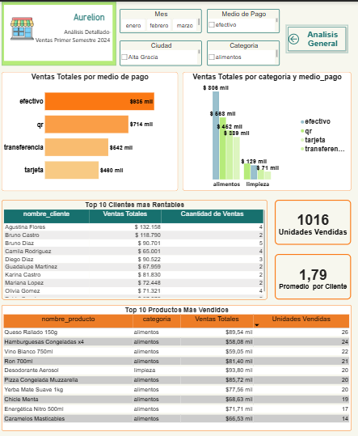

# Proyecto IBM -GUAYERD– Análisis de Datos

## Descripción
Proyecto realizado como parte del programa de formación de IBM.
El objetivo del trabajo es aplicar técnicas de análisis de datos para obtener
insights relevantes a partir de un conjunto de datos.

## Herramientas utilizadas
- Python
- Jupyter Notebook
- Pandas
- Matplotlib / Seaborn
- Power BI 

## Contenido del proyecto
- Limpieza y preparación de datos
- Análisis exploratorio
- Visualización de datos
- Conclusiones y resultados

## Estado del proyecto
Proyecto entregado. Certificado en proceso de emisión.

## Autora
Erica Almirón

## SPRINT 1 - Descripcion del proyecto 
# Proyecto Aurelion

## 📌 Descripción del tema
El proyecto **Aurelion** es un sistema inicial que busca organizar y gestionar información relacionada con clientes, productos y ventas.  
La base de datos está diseñada para simular un entorno similar al de un supermercado, ya que cuenta con variedad de productos y operaciones de venta.

## ⚡ Problema
Actualmente, la gestión de clientes, productos y ventas puede ser desordenada si se lleva de manera manual o en planillas separadas.  
Esto genera dificultades para:
- Registrar la información de los clientes.
- Controlar el detalle de cada venta.
- Consultar fácilmente el historial de ventas y productos.

## 💡 Posible solución
La solución propuesta es implementar una **base de datos estructurada** que permita almacenar, organizar y relacionar de manera eficiente la información de clientes, productos y ventas.  
De esta manera se facilita el control y la consulta de los datos.

---

## 🗄️ Estructura de la Base de Datos

El sistema consta de 4 tablas principales:

### 1. Cliente
- `id_cliente`
- `mail`
- `fecha_alta`
- `ciudad`

### 2. Productos
- `id_producto`
- `nombre_producto`
- `categoria`
- `precio_unitario`

### 3. Ventas
- `id_venta`
- `fecha`
- `id_cliente`
- `nombre_cliente`
- `mail`
- `medio_pago`

### 4. Detalle_Venta
- `id_venta`
- `id_producto`
- `nombre_producto`
- `cantidad`
- `precio_unitario`
- `importe`

---

## ✅ Conclusión
Este proyecto se encuentra en una fase inicial de diseño.  
Por el momento, solo se cuenta con la definición de las tablas y los datos que almacenan.  
Más adelante se definirá la funcionalidad exacta del sistema, pero esta base servirá como punto de partida para el desarrollo de aplicaciones de ventas y control de clientes.

-----------------------------------------------------------

INICIO

1. Abrir la carpeta "Proyecto Aurelion"
2. Importar el archivo de la base de datos
3. Crear la estructura con las tablas:
    - Cliente
    - Productos
    - Ventas
    - Detalle_Venta
4. Guardar los datos iniciales (clientes, productos, etc.)
5. Para consultar información:
    - Si quiero ver clientes -> abrir tabla Cliente
    - Si quiero ver productos -> abrir tabla Productos
    - Si quiero ver ventas -> abrir tabla Ventas
    - Si quiero ver el detalle de una venta -> abrir tabla Detalle_Venta
6. Continuar cargando o consultando según se necesite
7. Guardar los cambios realizados
8. Cerrar la base de datos

FIN

---------------------------------------------------------------
## SPRINT 2 - Limpieza, Tranformacion y Analisis 
🧩 Conclusión General del Proyecto

Durante el desarrollo del Proyecto Aurelion, se diseñó y analizó una base de datos compuesta por cuatro tablas principales: clientes, productos, ventas y detalle_venta.
Cada conjunto de datos fue inspeccionado y limpiado para garantizar su calidad, eliminando duplicados, corrigiendo tipos de datos y validando valores numéricos y categóricos.

El proceso permitió obtener una base de datos limpia y estructurada, apta para análisis descriptivos y visualización de información mediante gráficos y estadísticas.
Gracias a esta organización, ahora es posible analizar las ventas por período, identificar patrones de comportamiento de clientes, productos más vendidos y medios de pago más utilizados.

El proyecto Aurelion sienta una base sólida para el análisis de datos comerciales, asegurando la integridad, coherencia y utilidad de la información almacenada.

----------------------------------------------------------------------------

📊 Análisis de Gráficos
----------------------------------------------------------
🟠 Gráfico 1: Distribución de Ventas por Medio de Pago
----------------------------------------------------------
Este gráfico muestra cómo se distribuyen las ventas según la forma de pago.
Podemos ver que el efectivo es el método más utilizado, representando alrededor del 31% del total.
Le siguen el QR (25%), la transferencia (22,5%) y finalmente la tarjeta (21,7%).
Esto indica que la mayoría de los clientes prefiere realizar sus compras en efectivo, aunque los medios electrónicos tienen una presencia importante, lo que demuestra una buena diversidad en las opciones de pago utilizadas.

---------------------------------------------------------
📦 Gráfico 2: Top 10 Productos Más Vendidos
---------------------------------------------------------

En este gráfico se destacan los productos con mayor volumen de ventas.
Entre los más vendidos se encuentran el Desodorante Aerosol, el Queso Rallado 150g, la Pizza Congelada Muzzarella y el Ron 700ml, entre otros.
Esto demuestra que los productos más comprados no pertenecen a una sola categoría: hay tanto artículos de limpieza como alimentos y bebidas.
Esto refuerza la idea de que el negocio tiene una oferta variada y que los clientes consumen productos de diferentes rubros.

----------------------------------------------------------
📅 Gráfico 3: Evolución de las Ventas Mensuales
----------------------------------------------------------

Este gráfico muestra cómo varían las ventas a lo largo de los meses.
Se observa una caída en abril, con el valor más bajo del período, mientras que mayo registra el pico más alto, superando los $560.000 en ventas.
En general, las ventas muestran cierta fluctuación, lo que puede deberse a factores estacionales, como fechas especiales o promociones.
Aun así, el nivel de ventas se mantiene estable hacia el final del período analizado.

--------------------------------------------------------------
3️⃣ Gráfico de columnas (ventas por mes)
--------------------------------------------------------------

El gráfico de columnas representa la evolución de las ventas mes a mes.
Permite detectar meses con mayor o menor nivel de ventas, lo que ayuda a analizar la estacionalidad o el impacto de campañas promocionales.
Si se observa una tendencia ascendente o picos en determinados meses, puede ser útil planificar futuras estrategias de marketing o reposición de stock.

------------------------------------------------------------------------------

📊 Distribución de variables

En esta parte se revisó cómo se distribuyen los datos principales del proyecto Aurelion, para conocer su estructura antes de avanzar con los gráficos y los análisis más detallados.

Clientes:
La base contiene distintos clientes que provienen de ciudades de la provincia de Córdoba.
Cada uno tiene su nombre, correo electrónico, ciudad y fecha de alta.
No se detectaron datos faltantes ni duplicados. Las fechas de alta están correctamente cargadas y distribuidas en distintos momentos del tiempo.

Productos:
La tabla de productos cuenta con dos categorías principales: “Limpieza” y “Alimentos”.
Sin embargo, se observó que algunos productos están mal clasificados, ya que hay artículos de alimentos registrados dentro de la categoría de limpieza.
Los precios unitarios son positivos y coherentes, pero se recomienda revisar las categorías para mejorar la consistencia del análisis posterior.

Ventas:
Cada venta contiene la fecha, el nombre del cliente, su correo y el medio de pago.
Todavía no se realizó el análisis gráfico de la distribución de los medios de pago, por lo que no se puede afirmar si están equilibrados o no.
Este punto se estudiará con más detalle en los gráficos de torta y barras.

Detalle de venta:
Esta tabla relaciona las ventas con los productos vendidos, incluyendo cantidad, precio unitario e importe.
No se detectaron valores negativos ni inconsistencias, y los cálculos entre precio y cantidad coinciden correctamente con el importe final.

En resumen, los datos se encuentran completos y con buena estructura general, aunque presentan algunos errores de clasificación en la categoría de productos que deberán corregirse en la etapa de limpieza definitiva.
Esto permitirá obtener resultados más precisos al momento de graficar y analizar el comportamiento de ventas y medios de pago.

--------------------------------------------------------------------------------

🧩 Detección de Outliers

Para analizar si existían valores atípicos en los importes de venta, se realizó un gráfico tipo boxplot.
En este gráfico se observan algunos puntos que se alejan del rango principal, lo que indica la presencia de ventas con importes significativamente mayores al resto.
Estos valores pueden representar ventas excepcionales o errores en la carga de datos, por lo que conviene analizarlos con más detalle antes de tomar decisiones basadas en ellos.

Análisis de Outliers:
Se calcularon los límites de valores normales según el rango intercuartílico (IQR).
Los valores de importe que superan los límites definidos se identificaron como outliers.
Estos representan ventas de importe significativamente más alto que el promedio, posiblemente ventas grandes o errores de registro.
Se detectaron 7 outliers, que se recomienda revisar antes de analizar los totales finales.

Límite inferior: -6624.75
Límite superior: 20345.25
Cantidad de outliers detectados: 7

En resumen:

El límite inferior es negativo → se ignora, porque no hay ventas con importe negativo.

El límite superior (20.345,25) → es el punto a partir del cual los valores se consideran outliers.

Tenés 7 ventas que superan ese valor, por lo tanto son outliers altos (ventas excepcionales o registros con importes inusualmente altos).

-----------------------------------------------------------------------------------

🔗 Análisis de Correlación entre Variables

Para este análisis se evaluó la relación entre el precio unitario, la cantidad vendida y el importe total de los productos.
Los resultados muestran lo siguiente:

Existe una correlación positiva moderada (0.68) entre el precio unitario y el importe, lo cual es lógico: los productos más caros generan montos totales más altos en las ventas.

También se observa una correlación positiva media (0.60) entre la cantidad y el importe, indicando que al aumentar las unidades vendidas, el total de la venta también aumenta.

Por otro lado, la correlación entre precio unitario y cantidad es ligeramente negativa (-0.07), lo que sugiere que los productos más caros tienden a venderse en menor cantidad, aunque la relación no es fuerte.

En resumen, los datos reflejan un comportamiento esperado del mercado: los precios altos se compensan con menores cantidades, y los montos totales dependen tanto del precio como del volumen vendido.

##   🔄 Proceso de Unificación y Análisis Avanzado

Durante esta etapa del proyecto se realizó la unificación de todas las tablas analizadas previamente, integrando clientes, productos, ventas y detalle de ventas en un único dataset consolidado.

Este proceso permitió:

Corregir inconsistencias en las categorías de productos.

Unificar criterios de fechas, importes y medios de pago.

Eliminar errores de clasificación que afectaban los análisis anteriores.

A partir del dataset unificado se generaron:

Indicadores clave de desempeño (KPIs).

Gráficos de ventas por mes, categoría, región y medio de pago.

Análisis de clientes y productos más relevantes.

Detección de valores atípicos (outliers).

Análisis de correlación entre variables.

Implementación de modelos básicos de Machine Learning.

Este enfoque permitió obtener una visión más completa y confiable del comportamiento comercial del negocio.

##  🤖Sprint 3 - Modelos de Machine Learning

Se implementaron dos modelos de Machine Learning con fines exploratorios:

Regresión Lineal

Se utilizó un modelo de regresión lineal para analizar la relación entre el tiempo y el importe de las ventas, con el objetivo de identificar tendencias generales.
El modelo permitió observar el comportamiento global de las ventas y evaluar su variación a lo largo del período analizado.

Clasificación

Se implementó un modelo de clasificación para categorizar las ventas según su nivel de importe.
Los resultados muestran que el modelo identifica la tendencia general, aunque presenta limitaciones para diferenciar correctamente las clases, lo cual es esperable debido al tamaño del dataset y al desbalance de las categorías.

Estos modelos cumplen una función introductoria y demostrativa dentro del proyecto.

## Sprint 4 – Dashboard en Power BI

En este sprint se desarrolló un dashboard interactivo en Power BI, aplicando buenas prácticas de modelado y visualización de datos para representar de forma clara los resultados del análisis realizado en los sprints anteriores.

### Objetivos
- Construir un modelo de datos eficiente y escalable.
- Crear visualizaciones interactivas orientadas al análisis.
- Facilitar la interpretación de indicadores clave para la toma de decisiones.

### Desarrollo
- Diseño e implementación de un **modelo estrella**, separando tablas de hechos y dimensiones.
- Creación de tablas auxiliares fundamentales para el análisis:
  - **Tabla Calendario**, para el manejo correcto de fechas y períodos.
  - **Tabla de Medidas**, centralizando las métricas y cálculos en DAX.
- Definición de relaciones entre tablas asegurando coherencia y rendimiento del modelo.
- Desarrollo de medidas utilizando **DAX** para el cálculo de indicadores clave.
- Construcción de visualizaciones:
  - Gráficos de barras, columnas y líneas
  - Tarjetas con métricas principales
  - Segmentadores para filtrar la información
- Configuración de **interacciones entre visuales**, permitiendo una navegación dinámica y contextual dentro del dashboard.
- Diseño del dashboard priorizando claridad visual, orden y usabilidad.

### Resultados
El dashboard final permite analizar los datos de manera intuitiva, identificar tendencias y patrones relevantes, y obtener una visión integral del comportamiento de la información analizada.

### Herramientas utilizadas
- Power BI
### Vista del Dashboard

